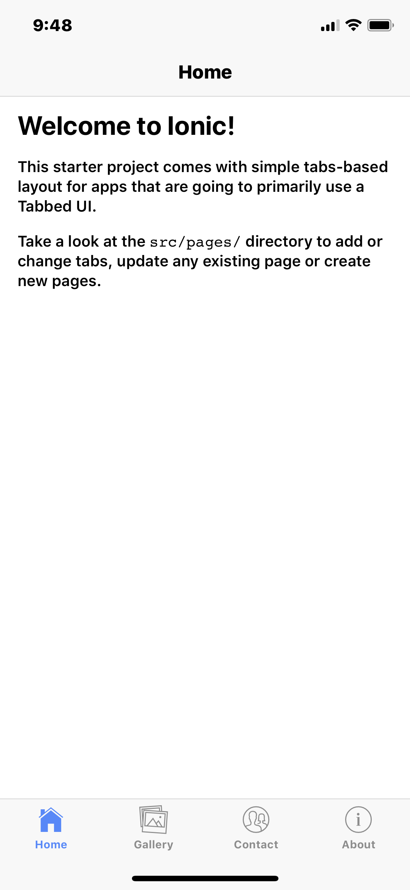

# ionic setup on osx
### 1. Create ionic account
[sign up](https://dashboard.ionicframework.com/signup)
### 2. Create project directory
example:
```
mkdir ~/Documents/workspace/projects/tutorial/ionic
```
### 3. install git and Node.js
[install on osx](http://osxdaily.com/2018/06/29/how-install-nodejs-npm-mac/)
```
brew update
brew install git
brew install node
node -v
```
### 4. install ionic
```
sudo npm install -g ionic
```
### 5. create NEW app
Next, create an Ionic app using “Tabs” app template. This starter project comes complete with three pre-built pages and best practices for Ionic development. With common building blocks already in place, we can add more features easily
```
ionic start photo-gallery tabs
```
- ? Integrate your new app with Cordova to target native iOS and Android? Yes
- ? Install the free Ionic Pro SDK and connect your app? Yes
- Log into your Ionic Pro account. Sign in now to easily access awesome features like Live Deploys later in this tutorial.
- Choose “Create a new app on Ionic Pro.”
- Would you like to create a new app on Ionic Pro? Yes
- Which git host would you like to use? Choose “Ionic Pro.”
- Choose “Automatically setup a new SSH key pair for Ionic Pro” if you haven’t used SSH before. remember pass phrase
### 6. change into app directory
```
cd photo-gallery/
```

### 7. push code to ionic pro (enter pass phrase)
```
git add .
git commit -m "initial app creation"
git push ionic master
```

### 8. Run app
```
ionic serve
[INFO] Development server running!
[INFO] Browser window opened to http://localhost:8100!
```
### 9. View in browser
Open browser & navigate to http://localhost:8100/
### 10. View in ionic dashboard
```
https://dashboard.ionicframework.com/apps
```

### 11. Make simple changes to about.html and push to ionic master
```
project/src/pages/about
project/src/pages/tabs
```
```
<ion-tabs>
    <ion-tab [root]="tab1Root" tabTitle="Home" tabIcon="home"></ion-tab>
    <ion-tab [root]="tab2Root" tabTitle="Gallery" tabIcon="images"></ion-tab>
    <ion-tab [root]="tab3Root" tabTitle="Contact" tabIcon="contacts"></ion-tab>
    <ion-tab [root]="tab4Root" tabTitle="About" tabIcon="information-circle"></ion-tab>
</ion-tabs>
```
### 12. commit & view changes
```
git add .
git commit -m "simple changes to tabs"
git push ionic master
ionic serve
```


### 13. view in mobile dev app
- install devapp via appstore or sms link 
[dev app](https://ionicframework.com/docs/pro/devapp/)
- open app in phone. make sure on same network and it will listen and auto load app
```
ionic serve -c
```




